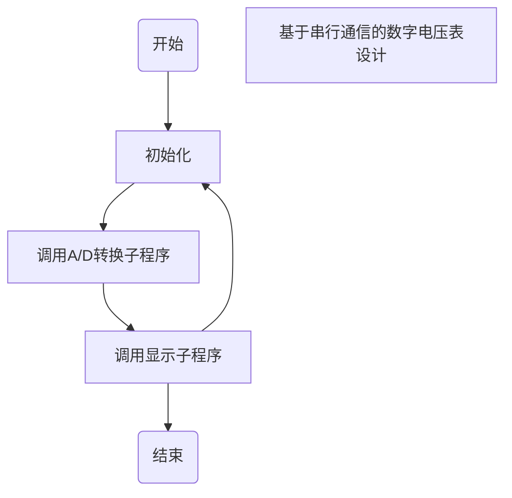

- docker内目录

  ```shell
  docker container exec -it de45 /bin/sh
  ```

- 保持nodejs脚本运行

  ```shell
  forever start xxx
  ```

- Replace Pioneer激活

  ```shell
  http://www.mind-pioneer.com
  ```

- github推送

  ```shell
  git commit -m "test1"
  git push
  ```

- 256服务器aria信息

  ```shell
  IPv4 地址      : 209.141.62.192
   IPv6 地址      : IPv6 地址检测失败
   RPC 端口       : 6800
   RPC 密钥       : d73d8db7633ae5380254
   下载目录       : /root/downloads
   AriaNg 链接    : http://ariang.js.org/#!/settings/rpc/set/ws/209.141.62.192/680
  0/jsonrpc/ZDczZDhkYjc2MzNhZTUzODAyNTQ=
  ```

- 群晖screen

  ```shell
  TERM=xterm screen
  ```

- rclonetest123

  ```shell
  /volume1/docker/rclone/rclone-v1.53.2-linux-amd64/rclone copy onedrive:网课资料/typora笔记/source/_posts /volume1/docker/hexo/source/_posts -P
  ```

- Mooc cdk

  ```shell
  77d25ccf90657e7876e911a90daf5d74953e4f5b39f392ef13282ae2972bd2a1
  ```
  
- MAC挂载NTFS硬盘(NTFS-3G)

  ```shell
  sudo diskutil unmount /dev/disk2s1
  sudo mkdir /Volumes/NTFS
  sudo /usr/local/bin/ntfs-3g /dev/disk2s1 /Volumes/NTFS -o local -o allow_other -o auto_xattr -o auto_cache
  ```

  

- 流程图模板代码：




- 清除DS_store文件

```shell

find . -name ".DS_Store" -depth -exec rm {} \;

```


