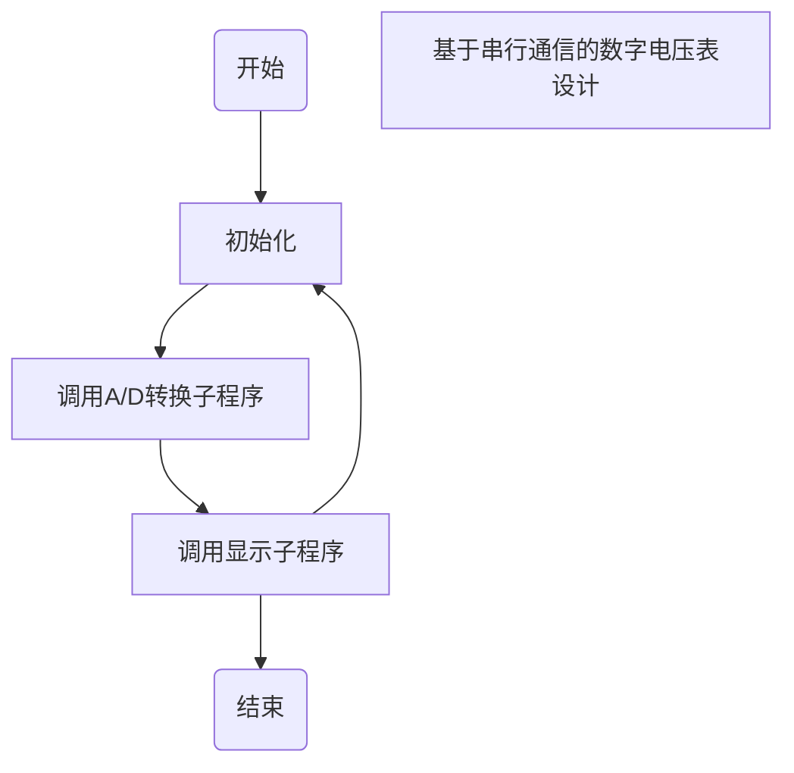

- docker内目录

  ```shell
  docker container exec -it de45 /bin/sh
  ```

- 保持nodejs脚本运行

  ```shell
  forever start xxx
  ```

- Replace Pioneer激活

  ```shell
  http://www.mind-pioneer.com
  ```

- github推送

  ```shell
  git commit -m "test1"
  git push
  ```

- 256服务器aria信息

  ```shell
  IPv4 地址      : 209.141.62.192
   IPv6 地址      : IPv6 地址检测失败
   RPC 端口       : 6800
   RPC 密钥       : d73d8db7633ae5380254
   下载目录       : /root/downloads
   AriaNg 链接    : http://ariang.js.org/#!/settings/rpc/set/ws/209.141.62.192/680
  0/jsonrpc/ZDczZDhkYjc2MzNhZTUzODAyNTQ=
  ```

- 群晖screen

  ```shell
  TERM=xterm screen
  ```

- rclonetest123

  ```shell
  rclone copy /256/downloads/SEAL.Team.S02.1080p.AMZN.WEBRip.DDP5.1.x264-NTb\[rartv\] megumi1:SEAL.Team/S02 -P -P
  ```

- Mooc cdk

  ```shell
  77d25ccf90657e7876e911a90daf5d74953e4f5b39f392ef13282ae2972bd2a1
  ```
  
- MAC挂载NTFS硬盘(NTFS-3G)

  ```shell
  sudo diskutil unmount /dev/disk2s1
  sudo mkdir /Volumes/NTFS
  sudo /usr/local/bin/ntfs-3g /dev/disk2s1 /Volumes/NTFS -o local -o allow_other -o auto_xattr -o auto_cache
  ```

- 流程图模板代码：



- 清除DS_store文件

```shell

find . -name ".DS_Store" -depth -exec rm {} \;

```

- MAC终端命令

```shell
ssh -p 4096 admin@222.65.137.121
ssh -p 22 root@192.168.8.1

```

- 群晖you-get命令

```shell
/volume1/docker/you-get/you-get-develop/you-get
```

- onedriveuploader命令

```shell
OneDriveUploader -c "/root/yujiadong24@gmail.com.json" -f "Shameless.US.S11.1080p.AMZN.WEBRip.DDP5.1.x264-NTb[rartv]" -tgbot "1791554665:AAEWtGH3_OnReaAqVrZCtA9rTUDrCAl_hXo" -uid 974470043
```

- onedrive API

```shell
2f57efdc-9116-4a47-9269-a57285babe56
用户端密码：Sb7C25~DRp1f55Nns2._lwgdO2v-7-G3~3
```

- 取消对ios设备的备份

``` shell
defaults write com.apple.iTunes DeviceBackupsDisabled -bool YES //取消更新
defaults delete com.apple.iTunes DeviceBackupsDisabled  //启动更新
```

- buyvm挂载2盘

``` shell
mount /dev/test_2/test_l2 /256a
```
