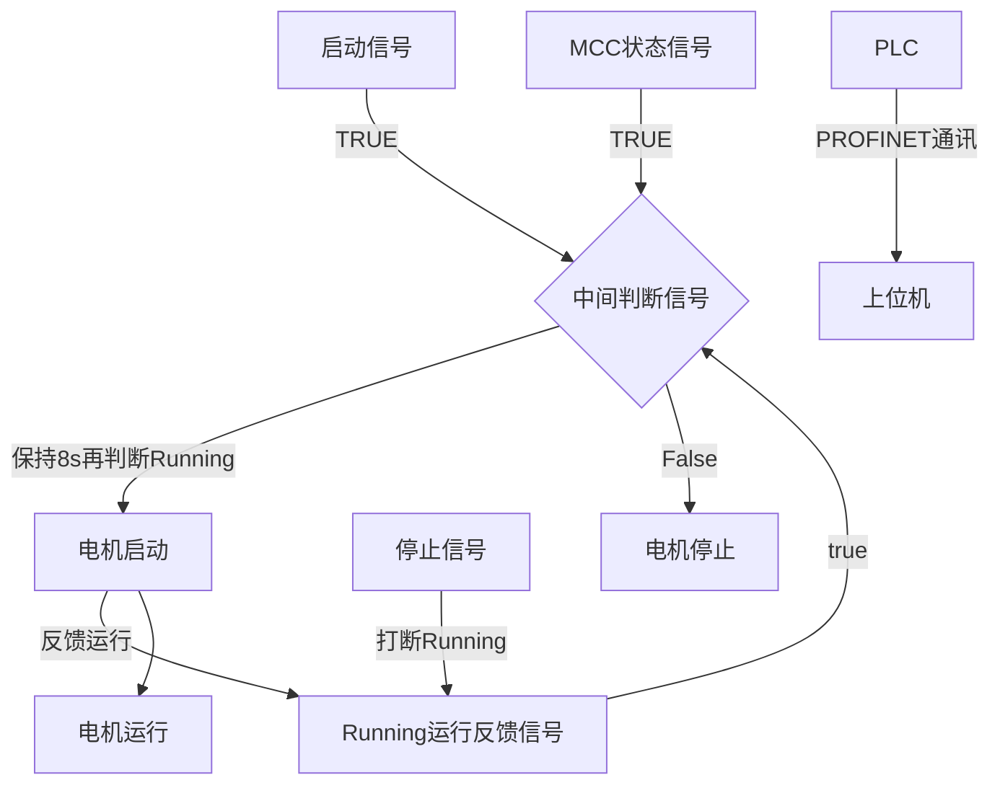

# 实习总结

## 硬件方面

- 初步掌握了西门子S7-1200系列PLC的硬件情况
  - 自带220V交流电源输入
  - 6口数字输入
  - 4口数字输出
  - 使用PROFINET工业以太网接口通讯
- 了解如何通过PORTAL（博途）与PLC进行在线通讯/调试，了解在实验情况下如何手动提供输入信号

## 软件方面

- 初步学习了PORTAL（博途）的使用方式，梯形图编程的基本方法
- 学习了FramView上位机软件
  - 设置实时监测的数据变量
  - 设计用户界面
  - 在用户界面中加入指令按钮，使得能用上位机控制PLC信号
  - 在用户界面中使用图形/颜色变化读取PLC当前数据

## 实际操作流程

### 博途软件操作

1. 启动博途软件，创建新工程并选好当前PLC型号（以订货号为准）
2. 打开详细视图，设置所需要的硬件组态（包括扩展模组），在PROFINET选项中设置PLC的IP地址，尝试在PC机中PING通实体PLC
3. 在“程序块”组中添加所需的程序块（FB、FC），并在其中写入程序
4. 右键点击程序块，下载到设备，程序会自动检查并编译
5. 在需要监视的程序块中打开在线监视，能够看到每一步的情况

### 上位机软件操作

1. 先安装与PLC信号相同的驱动，并且选择所使用的的通讯方式
2. 在数据库中添加需要监视的端口号，并确认是何种类型的端口（数字量输入/输出/双工、模拟量输入/输出/双工等）
3. 在画面制作中放入自己想要的元素并且关联有关变量
4. 启动监视程序并开始试验

## 总结

​	在公司实习的这三周的时间中，从最开始的对PLC工程运用只有大概的概念，到现在能够独立完成简单的PLC程序并与上位机完成联合调试。其中少不了带我入门的魏工的帮助，从最基础的PLC硬件到专用编程软件的使用方式，再到最后的上位机界面设计以及联合调试，魏工提供了详尽的资料并且细心地指点我。让我在短时间内大概了解了PLC工控设备的实际运用上的操作方式以及工作流程。在实践过程中发现了很多问题是仅靠书本上的理论学习无法发现的，比如在PC和PLC在线通讯中，PLC的固件版本必须和PC机中设置的相同，否则无法进行通讯。

​	本次实习的主要项目是完成一个电机启停的控制项目，要求是完成对PLC的编程，输入信号分别为：启动信号、停止信号、MCC稳定信号、Running运行反馈信号；输出信号为：电机运行指令信号。要求实现电机启停控制、用户界面监控状态、用户界面启停电机按钮。采用梯形图完成编程。

​	硬件部分由于条件限制，采用了三相电线直接接入的供电方式，输入端信号由短接信号手动给出，PC与PLC通讯通过网线连接完成通讯

| IO口     | 接线         |
| -------- | ------------ |
| L1       | 交流电源零线 |
| N        | 交流电源火线 |
| L+       | 短接点       |
| M        | 输入端口供电 |
| 1M       | 输入端口供电 |
| DI0.0~.5 | 按表3-2接入  |

